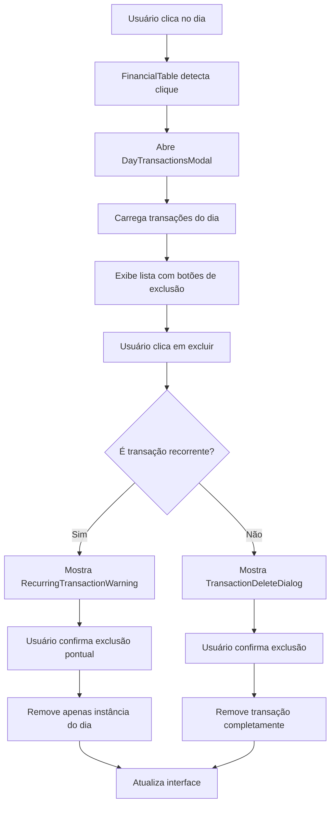

# Design Document

## Overview

Este documento descreve o design para implementar um sistema completo de exclusão de lançamentos no diário financeiro. O sistema será integrado à funcionalidade existente, aproveitando a estrutura atual de navegação por dias e adicionando capacidades robustas de visualização e exclusão de transações, com tratamento especial para transações recorrentes.

## Architecture

### Componentes Principais

1. **DayTransactionsModal** - Modal para exibir todas as transações de um dia específico
2. **TransactionDeleteDialog** - Diálogo de confirmação para exclusão de transações
3. **RecurringTransactionWarning** - Componente de aviso específico para transações recorrentes
4. **TransactionListItem** - Item individual da lista de transações com botão de exclusão

### Fluxo de Dados



## Components and Interfaces

### DayTransactionsModal

```typescript
interface DayTransactionsModalProps {
  isOpen: boolean;
  onClose: () => void;
  selectedDate: Date;
  transactions: TransactionEntry[];
  onDeleteTransaction: (transactionId: string, isRecurring: boolean) => void;
  onNavigateToRecurring: () => void;
}
```

**Responsabilidades:**
- Exibir todas as transações de um dia específico
- Mostrar informações detalhadas de cada transação
- Fornecer botões de exclusão para cada item
- Indicar visualmente transações recorrentes
- Ser responsivo para dispositivos móveis

### TransactionListItem

```typescript
interface TransactionListItemProps {
  transaction: TransactionEntry;
  onDelete: (transactionId: string, isRecurring: boolean) => void;
  isRecurring: boolean;
}
```

**Responsabilidades:**
- Exibir informações da transação (descrição, valor, categoria, tipo)
- Mostrar indicador visual para transações recorrentes
- Fornecer botão de exclusão com ícone de lixeira
- Aplicar estilos condicionais baseados no tipo de transação

### RecurringTransactionWarning

```typescript
interface RecurringTransactionWarningProps {
  isOpen: boolean;
  onClose: () => void;
  onConfirmDelete: () => void;
  onNavigateToRecurring: () => void;
  transactionDescription: string;
  transactionDate: string;
}
```

**Responsabilidades:**
- Exibir aviso específico sobre exclusão de transação recorrente
- Explicar que apenas a instância do dia será removida
- Fornecer link direto para gerenciamento de transações recorrentes
- Permitir confirmação da exclusão pontual

### TransactionDeleteDialog

```typescript
interface TransactionDeleteDialogProps {
  isOpen: boolean;
  onClose: () => void;
  onConfirm: () => void;
  transactionDescription: string;
  transactionValue: number;
}
```

**Responsabilidades:**
- Exibir diálogo de confirmação para exclusão normal
- Mostrar detalhes da transação a ser excluída
- Fornecer botões de confirmação e cancelamento
- Aplicar estilos de alerta apropriados

## Data Models

### Extended TransactionEntry

```typescript
interface TransactionEntry {
  id: string;
  date: string;
  description: string;
  amount: number;
  type: 'entrada' | 'saida' | 'diario';
  category?: string;
  isRecurring: boolean;
  recurringId?: string; // ID da transação recorrente pai
  source: 'manual' | 'recurring' | 'quick-entry';
}
```

### Transaction Deletion Context

```typescript
interface TransactionDeletionContext {
  transactionId: string;
  isRecurring: boolean;
  recurringId?: string;
  date: string;
  description: string;
  amount: number;
  type: 'entrada' | 'saida' | 'diario';
}
```

## Error Handling

### Estratégias de Tratamento de Erro

1. **Validação de Entrada**
   - Verificar se a transação existe antes da exclusão
   - Validar permissões de exclusão
   - Verificar integridade dos dados

2. **Recuperação de Falhas**
   - Implementar rollback em caso de erro na exclusão
   - Manter backup temporário antes da exclusão
   - Exibir mensagens de erro claras para o usuário

3. **Prevenção de Conflitos**
   - Verificar se a transação não foi modificada por outro processo
   - Implementar locks temporários durante exclusão
   - Validar estado da transação antes da operação

### Error Messages

```typescript
const ERROR_MESSAGES = {
  TRANSACTION_NOT_FOUND: 'Transação não encontrada',
  DELETION_FAILED: 'Falha ao excluir transação',
  RECURRING_DELETION_FAILED: 'Falha ao excluir instância recorrente',
  PERMISSION_DENIED: 'Permissão negada para exclusão',
  NETWORK_ERROR: 'Erro de conexão. Tente novamente.',
  INVALID_TRANSACTION: 'Dados da transação inválidos'
};
```

## Testing Strategy

### Unit Tests

1. **DayTransactionsModal**
   - Renderização correta da lista de transações
   - Exibição de indicadores para transações recorrentes
   - Funcionamento dos botões de exclusão
   - Responsividade em diferentes tamanhos de tela

2. **TransactionDeleteDialog**
   - Exibição correta dos dados da transação
   - Funcionamento dos botões de confirmação/cancelamento
   - Validação de entrada do usuário

3. **RecurringTransactionWarning**
   - Exibição correta do aviso
   - Funcionamento do link para transações recorrentes
   - Confirmação de exclusão pontual

### Integration Tests

1. **Fluxo Completo de Exclusão**
   - Teste do fluxo desde clique no dia até exclusão
   - Verificação de atualização da interface
   - Teste de exclusão de transações recorrentes vs normais

2. **Sincronização de Dados**
   - Verificação de atualização dos totais após exclusão
   - Teste de propagação de saldos
   - Validação de integridade dos dados

### E2E Tests

1. **Cenários de Usuário**
   - Exclusão de transação normal
   - Exclusão de transação recorrente com aviso
   - Navegação para gerenciamento de recorrentes
   - Cancelamento de exclusão

2. **Responsividade**
   - Teste em dispositivos móveis
   - Teste em tablets
   - Teste em desktop

## Implementation Notes

### Integração com Sistema Existente

1. **FinancialTable Enhancement**
   - Modificar o clique no dia para abrir modal de transações
   - Manter funcionalidade existente de navegação para quick-entry
   - Adicionar indicador visual mais claro para dias com transações

2. **Data Layer Integration**
   - Utilizar hooks existentes (useFinancialData, useTransactions)
   - Integrar com sistema de controle de transações existente
   - Manter compatibilidade com sistema de transações recorrentes

3. **UI/UX Consistency**
   - Seguir padrões de design existentes
   - Utilizar componentes UI já estabelecidos
   - Manter consistência de cores e tipografia

### Performance Considerations

1. **Lazy Loading**
   - Carregar transações do dia apenas quando modal é aberto
   - Implementar paginação se necessário para muitas transações

2. **Memoization**
   - Memoizar componentes de lista para evitar re-renders
   - Otimizar cálculos de totais após exclusões

3. **State Management**
   - Minimizar re-renders desnecessários
   - Otimizar atualizações de estado após exclusões