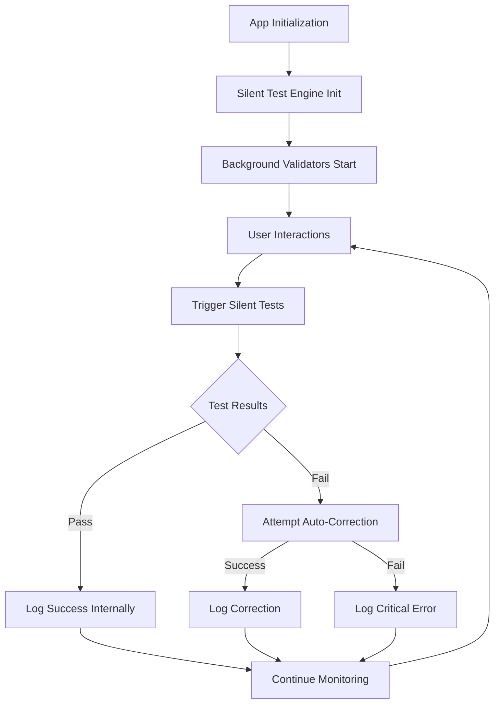

# Design Document - Sistema de Testes Oculto

## Overview

O sistema de testes oculto é uma arquitetura de auditoria silenciosa que executa validações críticas da lógica financeira em background, completamente invisível ao usuário final. O sistema utiliza workers assíncronos, logs internos criptografados e correção automática de inconsistências menores.

## Architecture

### Core Components

```
Hidden Test System
├── Silent Test Engine (Core)
├── Background Validators (Workers)
├── Internal Logger (Encrypted)
├── Auto-Corrector (Recovery)
└── Performance Monitor (Throttling)
```

### Execution Flow



## Components and Interfaces

### 1. Silent Test Engine

**Location:** `src/internal/testing/SilentTestEngine.ts`

```typescript
interface SilentTestEngine {
  initialize(): void;
  scheduleTests(trigger: TestTrigger): void;
  executeTestSuite(suite: TestSuite): Promise<TestResult>;
  isRunning(): boolean;
  shutdown(): void;
}

interface TestTrigger {
  type: 'startup' | 'transaction' | 'navigation' | 'periodic';
  context?: any;
  priority: 'low' | 'medium' | 'high';
}
```

### 2. Background Validators

**Location:** `src/internal/validators/`

```typescript
interface BackgroundValidator {
  name: string;
  priority: number;
  validate(context: ValidationContext): Promise<ValidationResult>;
  canAutoCorrect(): boolean;
  autoCorrect(issue: ValidationIssue): Promise<CorrectionResult>;
}

// Specific Validators
- FinancialCalculationValidator
- CurrencyFormattingValidator  
- RecurringTransactionValidator
- BalancePropagationValidator
- DataIntegrityValidator
```

### 3. Internal Logger

**Location:** `src/internal/logging/InternalLogger.ts`

```typescript
interface InternalLogger {
  logTestResult(result: TestResult): void;
  logCriticalIssue(issue: CriticalIssue): void;
  logAutoCorrection(correction: CorrectionResult): void;
  logPerformanceMetric(metric: PerformanceMetric): void;
  exportLogs(): EncryptedLogData; // Only in dev mode
}
```

### 4. Auto-Corrector

**Location:** `src/internal/correction/AutoCorrector.ts`

```typescript
interface AutoCorrector {
  canCorrect(issue: ValidationIssue): boolean;
  attemptCorrection(issue: ValidationIssue): Promise<CorrectionResult>;
  rollbackCorrection(correctionId: string): Promise<void>;
}
```

### 5. Performance Monitor

**Location:** `src/internal/monitoring/PerformanceMonitor.ts`

```typescript
interface PerformanceMonitor {
  measureImpact(): PerformanceImpact;
  shouldThrottle(): boolean;
  adjustTestFrequency(load: SystemLoad): void;
  pauseIfNecessary(): void;
}
```

## Data Models

### Test Configuration

```typescript
interface HiddenTestConfig {
  enabled: boolean;
  environment: 'development' | 'production';
  testFrequency: {
    startup: boolean;
    onTransaction: boolean;
    periodic: number; // minutes
    onNavigation: boolean;
  };
  logging: {
    level: 'minimal' | 'detailed';
    encryption: boolean;
    retention: number; // days
  };
  autoCorrection: {
    enabled: boolean;
    maxAttempts: number;
    rollbackOnFailure: boolean;
  };
  performance: {
    maxCpuUsage: number; // percentage
    maxMemoryUsage: number; // MB
    throttleThreshold: number;
  };
}
```

### Test Results

```typescript
interface HiddenTestResult {
  id: string;
  timestamp: number;
  suite: string;
  validator: string;
  status: 'pass' | 'fail' | 'corrected' | 'critical';
  executionTime: number;
  memoryUsage: number;
  details?: EncryptedDetails;
  autoCorrection?: CorrectionResult;
}
```

## Error Handling

### Silent Error Management

1. **Non-Critical Errors:** Log internally, attempt auto-correction
2. **Critical Errors:** Log with high priority, disable problematic tests
3. **Performance Issues:** Auto-throttle or pause testing
4. **Memory Leaks:** Auto-cleanup and restart test engine

### Error Recovery Strategy

```typescript
interface ErrorRecoveryStrategy {
  detectIssue(error: TestError): IssueType;
  attemptRecovery(issue: IssueType): Promise<RecoveryResult>;
  escalateIfNeeded(issue: IssueType): void;
}
```

## Testing Strategy

### Test Categories

1. **Startup Tests:** Execute once on app initialization
   - Basic calculation validation
   - Currency formatting checks
   - Data integrity verification

2. **Transaction Tests:** Execute on financial operations
   - Balance calculation accuracy
   - Currency parsing validation
   - Data consistency checks

3. **Navigation Tests:** Execute on month/year changes
   - Balance propagation validation
   - Recurring transaction processing
   - Data structure integrity

4. **Periodic Tests:** Execute at regular intervals
   - Memory usage monitoring
   - Performance impact assessment
   - Long-term data consistency

### Test Execution Strategy

```typescript
interface TestExecutionStrategy {
  immediate: TestSuite[]; // Execute immediately
  deferred: TestSuite[];  // Execute when idle
  background: TestSuite[]; // Execute in web worker
  conditional: ConditionalTest[]; // Execute based on conditions
}
```

## Security Considerations

### Data Protection

1. **Log Encryption:** All internal logs encrypted with rotating keys
2. **Memory Cleanup:** Sensitive test data cleared after execution
3. **Access Control:** Test system only accessible in development builds
4. **Audit Trail:** All test executions logged with timestamps

### Privacy Protection

1. **No User Data Exposure:** Tests work with anonymized/synthetic data
2. **Local Storage Only:** No external transmission of test results
3. **Minimal Footprint:** Test artifacts automatically cleaned up
4. **Development Only:** Detailed logging only in development mode

## Implementation Details

### File Structure

```
src/internal/
├── testing/
│   ├── SilentTestEngine.ts
│   ├── TestScheduler.ts
│   └── TestSuiteManager.ts
├── validators/
│   ├── FinancialCalculationValidator.ts
│   ├── CurrencyFormattingValidator.ts
│   ├── RecurringTransactionValidator.ts
│   └── BalancePropagationValidator.ts
├── logging/
│   ├── InternalLogger.ts
│   ├── LogEncryption.ts
│   └── LogManager.ts
├── correction/
│   ├── AutoCorrector.ts
│   └── CorrectionStrategies.ts
└── monitoring/
    ├── PerformanceMonitor.ts
    └── SystemHealthChecker.ts
```

### Integration Points

1. **App Initialization:** Hook into main app startup
2. **Financial Hooks:** Integrate with existing financial data hooks
3. **Navigation Events:** Hook into route changes
4. **Storage Events:** Monitor localStorage operations

### Environment Configuration

```typescript
// Development Mode
const DEV_CONFIG: HiddenTestConfig = {
  enabled: true,
  logging: { level: 'detailed', encryption: false },
  testFrequency: { periodic: 5 }, // Every 5 minutes
  autoCorrection: { enabled: true }
};

// Production Mode  
const PROD_CONFIG: HiddenTestConfig = {
  enabled: true,
  logging: { level: 'minimal', encryption: true },
  testFrequency: { periodic: 60 }, // Every hour
  autoCorrection: { enabled: true, maxAttempts: 1 }
};
```

## Performance Optimization

### Resource Management

1. **Lazy Loading:** Test modules loaded only when needed
2. **Memory Pooling:** Reuse test objects to minimize GC pressure
3. **Batch Processing:** Group similar tests for efficiency
4. **Throttling:** Reduce test frequency under high load

### Monitoring and Adaptation

1. **CPU Usage Monitoring:** Pause tests if CPU usage > threshold
2. **Memory Monitoring:** Cleanup and restart if memory usage high
3. **User Activity Detection:** Reduce testing during active usage
4. **Battery Awareness:** Reduce testing on mobile devices with low battery

## Deployment Strategy

### Build Integration

1. **Development Builds:** Full test system with detailed logging
2. **Production Builds:** Minimal test system with encrypted logging
3. **Test Builds:** Enhanced test system with additional diagnostics
4. **Release Builds:** Optional test system disable flag

### Rollout Plan

1. **Phase 1:** Implement core silent test engine
2. **Phase 2:** Add financial calculation validators
3. **Phase 3:** Implement auto-correction system
4. **Phase 4:** Add performance monitoring and throttling
5. **Phase 5:** Full integration and optimization